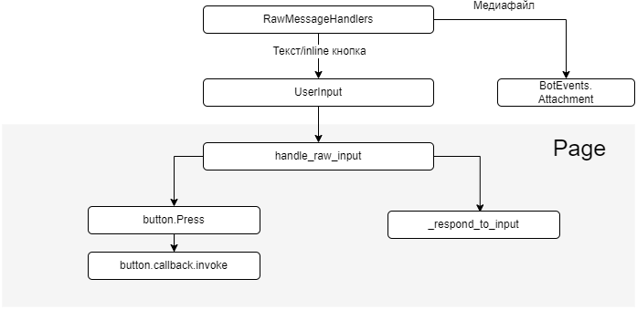

# Порядок обработки пользовательского ввода

* RawMessageHandlers имеет нативную реализацию для конкретного месседжера, перехватывает обработку сообщений
* Если юзер отправил картинку, вызывается соответсвующий ивент с байтами картинки в аргументах
* _respond_to_input (метод переопределяемый) вызывается, если пользователь отправил текстовое сообщение, но не нажал ни
  одну из кнопок страницы